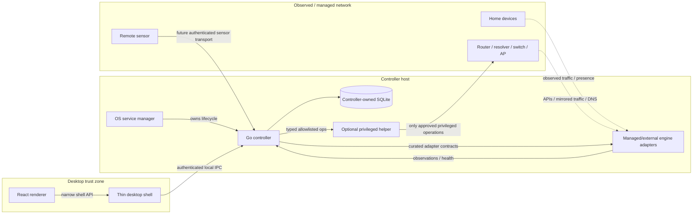

# System model

## Overview

Cozy SOC is a **modular monolith at the controller layer**, surrounded by narrow platform and integration adapters. The design avoids both extremes: a GUI process that owns everything, and a household microservice platform.

The diagram shows **control and data boundaries**, not a claim that every deployment contains every component.

## Components

### React renderer

Purpose: render the user experience and collect user intent.

The renderer is treated as the least-trusted local application component. It must not receive:

- generic process execution;
- direct service-manager access;
- packet-capture privileges;
- router or resolver credentials;
- direct database access;
- unrestricted filesystem access; or
- a Docker/container-management socket.

Network-derived text and engine output are untrusted display data.

### Desktop shell

Purpose: provide the native window, OS integration needed by the UI, and a **narrow bridge** to the controller.

The shell is not the controller. It may help package/register the controller, but after installation the OS service mechanism owns the controller lifecycle. Shell exit, renderer reload, or shell crash must not be interpreted as a controller shutdown request.

The current preferred shell is documented separately as a Proposed ADR because #5 must validate packaging, service registration, and resource behavior.

### Controller

Purpose: be the single Cozy SOC authority for one installation.

Responsibilities:

- configuration and schema migrations;
- network-scope enrollment;
- capability desired/runtime/verified state;
- normalized observations and device identity;
- findings/incidents and audit history;
- storage quotas and retention execution;
- integration lifecycle through curated adapters;
- health/coverage derivation; and
- local API authorization.

The controller should run without administrator/root privileges for ordinary operation. Privileged operations are delegated narrowly.

### Local store

Owned exclusively by the controller. Other processes must use controller APIs rather than opening the database file.

This preserves one migration/retention authority and prevents the desktop UI, engines, or remote sensors from coupling themselves to physical tables.

### Privileged helper

Optional and platform-specific. It exists only for operations that cannot safely be performed by the ordinary controller identity.

Examples may eventually include service registration, capture-interface setup, or a specifically approved network configuration operation.

A helper exposes typed allowlisted operations with independent validation. It is not a root shell, arbitrary command runner, generic file writer, or router-command proxy.

### Engine adapters

An adapter represents one curated integration contract. An integration may be:

- **external** — user owns lifecycle/configuration; Cozy SOC observes/queries it;
- **managed local** — Cozy SOC owns a tested local deployment; or
- **managed remote** — Cozy SOC owns a tested deployment on an enrolled hub/sensor.

Ownership is explicit state. Connecting an external service does not authorize Cozy SOC to restart, upgrade, rewrite, or uninstall it.

### Remote sensor

A remote sensor is an observation source with a scoped identity. It does not become a peer controller and does not receive controller/router authority merely because it is enrolled.

Sensor events are authenticated in transit, schema-validated, size/rate bounded, and still treated as untrusted input after authentication. Offline buffering, replay, ordering, and revocation are handled by #15/#10.

## Controller deployment modes

### Desktop mode

- controller runs on the desktop host through the supported OS service mechanism;
- UI normally connects locally;
- device discovery and host-local checks can be useful without extra hardware;
- sleep/offline periods create explicit observation gaps.

### Hub mode

- the same controller core runs headlessly on an always-on Linux host;
- desktop/browser interfaces become clients of that controller;
- advanced engines and sensors may run locally on the hub or send normalized observations remotely;
- one installation has one authoritative controller during normal operation.

Migration from desktop to hub is an authority-transfer operation, not multi-primary replication.

## Local API boundary

The domain API is versioned independently from its transport.

For the desktop default:

- Unix-like systems should prefer a permissioned Unix-domain socket or equivalent local IPC;
- Windows should prefer a permissioned named pipe or equivalent local IPC;
- the renderer talks through the desktop shell rather than receiving a general local-network client; and
- Cozy SOC does not require an unauthenticated TCP listener on `localhost` or the LAN.

The exact RPC/serialization choice is deferred to #7/#8. Authorization remains server-side regardless of generated frontend types.

Future browser access to a headless hub is a separate adapter: explicitly enabled, authenticated, encrypted, origin-aware, and bound to the same domain authorization model. It must not weaken the local default.

## State distinctions

For every capability, keep at least these dimensions separate:

1. **desired state** — what the user asked Cozy SOC to configure;
2. **runtime state** — whether the relevant process/integration is running/responding;
3. **verified observation state** — whether expected current data is actually arriving from the declared scope; and
4. **enforcement authority** — whether a supported write-capable control point is available and authorized.

A process can be running while observation is unverified. A sensor can observe a device without being able to block it.

## Packaging versus lifecycle

A desktop bundle may carry the controller binary as an embedded external binary/resource. This is **distribution**, not runtime ownership.

The target runtime model is:

1. signed application package contains compatible controller/helper artifacts;
2. an explicit install/registration operation asks the platform service mechanism to own the controller;
3. controller starts/restarts independently of the UI;
4. UI connects when open; and
5. upgrade/uninstall coordinates artifacts and service registration without giving renderer code service-manager authority.

Issue #5 must prove this on the first desktop reference platform before the model is treated as validated packaging behavior.
