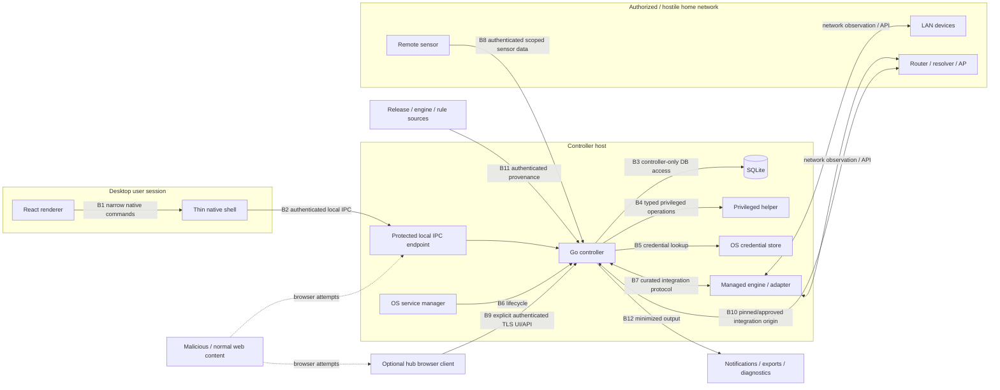

# Cozy SOC threat model

- **Status:** Foundation baseline
- **Date:** 2026-09-08
- **Primary issue:** #4
- **Architecture:** [`docs/architecture/`](../architecture/README.md)
- **Normative controls:** [`security-requirements.md`](security-requirements.md)

## Purpose

Cozy SOC is security software that intentionally observes sensitive household-network activity and will eventually manage services with elevated or network-changing capabilities. The product therefore has two simultaneous security responsibilities:

1. protect the household from the threats Cozy SOC is intended to surface; and
2. avoid becoming a new privileged attack surface inside the household.

This document models the second responsibility and the integrity/confidentiality requirements needed for trustworthy observations, findings, and actions.

The process follows the OWASP threat-modeling questions: what are we building, what can go wrong, what will we do about it, and how will we validate the result. STRIDE informed the adversarial review, but the maintained model is organized around concrete Cozy SOC abuse cases and testable controls rather than a checklist for its own sake.

References researched for this baseline:

- OWASP Threat Modeling Cheat Sheet: <https://cheatsheetseries.owasp.org/cheatsheets/Threat_Modeling_Cheat_Sheet.html>
- OWASP SSRF Prevention Cheat Sheet: <https://cheatsheetseries.owasp.org/cheatsheets/Server_Side_Request_Forgery_Prevention_Cheat_Sheet.html>
- OWASP CSRF Prevention Cheat Sheet: <https://cheatsheetseries.owasp.org/cheatsheets/Cross-Site_Request_Forgery_Prevention_Cheat_Sheet.html>

## Scope

The modeled target includes the architecture planned from Foundation through the v0.x releases:

- desktop React renderer and thin native shell;
- independently managed Go controller;
- controller-owned SQLite data store;
- OS service manager and narrowly scoped privileged helpers;
- curated local/remote/external integrations;
- future authenticated browser interface for a headless hub;
- future enrolled remote sensors;
- router/resolver/network-management APIs;
- installer, updater, managed-engine artifacts, rule/feed updates;
- notifications, exports, backups, and diagnostics; and
- explicitly authorized active checks and network-changing actions.

Not every component exists in v0.1. Requirements apply when the corresponding component is introduced.

## Security objectives

### O1 — Control-plane integrity

Only an authorized user/client may change Cozy SOC configuration, trust relationships, capability ownership, credentials, suppressions, or network actions.

### O2 — Least privilege

Compromise of the renderer, an integration, parser, engine, or remote sensor must not automatically become root/admin, service-manager, router-write, or arbitrary-process authority.

### O3 — Household-data confidentiality

Device identity, DNS/activity metadata, findings, credentials, endpoint details, packet-derived data, diagnostics, and backups must be collected and exposed only as needed.

### O4 — Evidence integrity and provenance

The app must preserve what source produced an observation, when it was observed/ingested, what scope it belonged to, and which inference transformed it into a finding. Untrusted observations never become trusted authority merely because they arrived through an enrolled source.

### O5 — Availability and bounded failure

Hostile network data, event floods, broken integrations, storage pressure, update failure, or malformed inputs must degrade specific capabilities without exhausting the controller or silently presenting stale data as healthy.

### O6 — Safe network interaction

Active probes and write actions must stay within explicitly authorized scope. Network changes require deliberate consent, target revalidation, verification, and a recovery path.

### O7 — Supply-chain integrity

Installed application/helper/engine/rule artifacts must have known provenance and must not be replaceable by untrusted pull-request code or arbitrary downloads.

## Assets

| ID | Asset | Why it matters |
| --- | --- | --- |
| A1 | Controller authority | Can alter Cozy SOC state and coordinate capabilities. |
| A2 | Privileged-helper authority | May configure services, capture interfaces, or future narrowly approved network state. |
| A3 | Router/resolver/integration credentials | Can expose household data or permit network changes. |
| A4 | Household telemetry | Device identities, DNS/activity metadata, flows, wireless observations, endpoint details, findings. |
| A5 | Evidence provenance/history | Determines whether findings and coverage claims are trustworthy. |
| A6 | Sensor identities and enrollment credentials | Define which remote producers are accepted and for which scope. |
| A7 | Signing/update material | Compromise can turn a trusted update into code execution. |
| A8 | Network availability/management access | Bad actions can break DNS, isolate the controller, or disconnect the household. |
| A9 | Backups/exports/diagnostics | Can aggregate sensitive metadata even when the live UI is protected. |
| A10 | User trust in coverage/finding state | Incorrect green states or overstated findings can cause unsafe decisions. |

## Adversaries and failure actors

| ID | Actor | Capabilities assumed |
| --- | --- | --- |
| T1 | Hostile LAN device | Can send crafted protocol traffic, names, discovery responses, high event volume, spoofable identity hints, and connection attempts. |
| T2 | Malicious website/browser content | Can attempt localhost/LAN requests, navigation tricks, CSRF, origin confusion, and social engineering. |
| T3 | Unprivileged local process or another local user | Can attempt local IPC/socket access, inspect world-readable files/logs, race predictable paths, and invoke exposed local services. |
| T4 | Compromised renderer | Can issue any command exposed through its native bridge and supply malicious arguments. |
| T5 | Compromised integration/engine | Can emit arbitrary malformed/hostile events and misleading health/data; may be able to make outbound connections according to its own privileges. |
| T6 | Compromised enrolled sensor | Possesses valid sensor identity but may send forged/replayed/out-of-scope data or attempt protocol abuse. |
| T7 | Malicious or compromised integration endpoint | May redirect, rebind DNS, present unexpected certificates/content, or attempt to obtain forwarded credentials. |
| T8 | Supply-chain attacker | Attempts to replace dependencies, releases, helper/engine binaries, rules, feeds, or updater metadata. |
| T9 | Authorized user error | Can approve an incorrect scope/action or misconfigure infrastructure; product should reduce blast radius and support recovery. |
| T10 | Local OS administrator/root | Can inspect process memory/files and replace local binaries. This is a major residual-risk boundary, not something the app can fully defend against. |

## Trust assumptions

Cozy SOC currently assumes:

- the underlying OS kernel, platform service manager, and trusted platform credential store behave according to their security contract;
- the user controls or is authorized to inspect the networks they enroll;
- application signing keys are protected outside ordinary untrusted CI jobs;
- TLS and standard cryptographic libraries are used rather than custom protocols; and
- a fully privileged local administrator can ultimately defeat local application confidentiality/integrity.

These assumptions reduce but do not eliminate the need to validate callers, arguments, scope, certificates, and artifacts at each application boundary.

## Data-flow and trust-boundary model

## Trust boundaries

| Boundary | Untrusted side | Trusted-side responsibility | Core requirements |
| --- | --- | --- | --- |
| B1 Renderer → shell | Renderer may be compromised by XSS/UI bug | Expose only narrow commands; validate every argument natively | SEC-005, SEC-006, SEC-007 |
| B2 Shell/local client → controller IPC | Other processes/users/websites may reach local endpoints | Authenticate/authorize caller; restrictive endpoint permissions; no ambient unauthenticated HTTP | SEC-001–SEC-004 |
| B3 Controller → data store | DB contents can contain hostile strings and stale evidence | Controller is sole DB owner; parameterized access; bounded migrations/storage | SEC-018, SEC-020, SEC-028 |
| B4 Controller → privileged helper | Controller inputs can be attacker-influenced through UI/network | Independently authenticate caller; allowlist operations; revalidate targets | SEC-009, SEC-010, SEC-024 |
| B5 Controller → secret store | UI/logging/integrations may try to obtain secrets | Secrets stay out of frontend/URLs/logs; retrieve only for approved operation | SEC-019 |
| B6 Service manager → controller | Install/update lifecycle can become privilege escalation | Signed known artifact and explicit registration; renderer has no generic service authority | SEC-005, SEC-022 |
| B7 Engine/integration → controller | Engine may be compromised or parse hostile network data | Treat output as untrusted; schema/size/rate bounds; engine cannot invoke control API | SEC-007, SEC-008, SEC-029 |
| B8 Sensor → controller | Sensor has valid identity but may be malicious | Mutual identity, scope binding, replay controls, data-plane-only authority | SEC-015–SEC-017 |
| B9 Browser → hub controller | LAN/web browser can be hostile | Explicit enablement, TLS, authentication, origin/CSRF controls, safe session handling | SEC-031 |
| B10 Controller → router/resolver/integration endpoint | Endpoint/hostname/redirect may be attacker-controlled | Bind credentials to enrolled authority; validate TLS; disable cross-authority redirects; revalidate DNS/address changes | SEC-011–SEC-014 |
| B11 Update source → installed artifacts | Network/repository/dependency source can be compromised | Verify provenance/integrity; isolate signing; reject unexpected downgrade/privilege expansion | SEC-022 |
| B12 Controller → external output | Lockscreen/export/support channel can leak data | Minimize/redact; user preview/consent; no secrets | SEC-021, SEC-026, SEC-033 |

## Abuse cases

Severity here is **design priority**, not a CVSS score for an implemented vulnerability.

| ID | Priority | Abuse case | Consequence | Required response / regression owner |
| --- | --- | --- | --- | --- |
| TM-001 | Critical | Compromised renderer invokes a generic shell/process/file/service command exposed by the native shell. | User-level compromise becomes root/admin or arbitrary code execution. | No generic bridge; command allowlist and argument validation. SEC-005–SEC-010; #8/#29. |
| TM-002 | Critical | A malicious website sends requests to an unauthenticated localhost controller endpoint. | Remote website changes configuration, reads household data, or triggers actions. | No unauthenticated management listener; authenticated local IPC; browser defenses when HTTP exists. SEC-002–SEC-004, SEC-031; #8/#29. |
| TM-003 | Critical | User-supplied or discovered integration URL causes SSRF or redirects credentials to another authority. | Controller attacks local/internal services or leaks router/resolver tokens. | Approved-origin binding, restricted schemes, redirect policy, address revalidation, credential scoping. SEC-011–SEC-014; #16/#17/#29. |
| TM-004 | Critical | Compromised remote sensor sends a message interpreted as a controller command or enforcement request. | Sensor compromise becomes control-plane/router authority. | Sensor identity is scoped data-plane authority only; action APIs reject sensor principals. SEC-015–SEC-017, SEC-025; #15/#27/#29. |
| TM-005 | Critical | Malicious update/dependency/engine artifact is installed as trusted code. | Persistent arbitrary code execution, potentially privileged. | Provenance/signature/integrity validation, pinned CI dependencies, isolated signing, rollback policy. SEC-022; #9/#20/#28/#29. |
| TM-006 | Critical | A network action uses a stale IP/device mapping or removes the only management path. | Wrong device blocked, DNS/network outage, owner loses access. | Revalidate identity/control point at execution, protected targets, preview, expiry/rollback, effectiveness verification. SEC-023–SEC-025; #16/#27/#29. |
| TM-007 | High | Hostile hostname/SSID/URL/log field is rendered as HTML or interpolated into a command/path. | XSS, command injection, path traversal, arbitrary navigation. | Treat all network/integration strings as hostile; context-aware encoding; no command/path construction from display values. SEC-007; #8/#10/#13/#29. |
| TM-008 | High | Another local user/process connects to Cozy SOC IPC. | Household data disclosure or unauthorized configuration. | Restrictive endpoint ACL/permissions and caller identity checks; fail closed on unknown principal. SEC-002–SEC-004; #8/#29. |
| TM-009 | High | Malicious engine/sensor floods huge or malformed events. | CPU/memory/disk exhaustion; monitoring blindness. | Per-source size/rate limits, bounded queues, timeouts, storage quotas, load-shedding with visible degradation. SEC-008, SEC-028, SEC-029; #10/#12/#29. |
| TM-010 | High | Compromised integration reports fabricated health/observations that make coverage appear healthy. | User trusts a blind sensor. | Health and verified observation are separate; freshness/validation evidence required; source confidence retained. SEC-027, SEC-029; #12/#19/#22/#29. |
| TM-011 | High | Credentials appear in URLs, frontend state, logs, crash dumps, diagnostics, or notifications. | Secret disclosure to users/apps/support channels. | Credential store, structured redaction, no URL secrets, minimized output. SEC-019, SEC-021, SEC-026; #8/#30/#29. |
| TM-012 | High | Integration follows a redirect or DNS change to a different host while retaining credentials. | Credential forwarding/SSRF despite initial endpoint validation. | Disable automatic cross-authority redirects; bind credentials to approved origin; revalidate resolved destinations and certificate trust. SEC-011–SEC-013; #16/#17/#29. |
| TM-013 | High | External AdGuard/router/Wazuh instance is treated as Cozy SOC-owned after connection. | User configuration is overwritten/stopped/uninstalled unexpectedly. | Explicit ownership state; read-only external mode; management transition requires consent/audit. SEC-014, SEC-030; #9/#16/#17/#26. |
| TM-014 | High | Replayed/out-of-order sensor events are treated as new evidence/current health. | False incident, double counting, stale green coverage. | Source IDs/checkpoints, replay/idempotency handling, separate source/ingestion times, bounded clock treatment. SEC-016, SEC-017, SEC-027; #10/#12/#15/#29. |
| TM-015 | High | A finding directly triggers blocking because the detector/LLM/engine labels activity malicious. | False positive becomes network outage or device isolation. | Findings never grant enforcement authority; deliberate authorized Action object required. SEC-025; #18/#27/#29. |
| TM-016 | High | Privileged helper accepts a path, command, interface, or target outside the intended operation. | Privilege escalation or arbitrary system modification. | Strong typed operation schema, canonicalization, allowlists, independent preconditions, no generic shell/file writer. SEC-009, SEC-010; #8/#29. |
| TM-017 | High | Database or export grows without bound because of network event volume. | Disk full breaks controller/host and loses evidence. | Per-class retention/quota, bounded ingestion, explicit data-loss/degraded state, no full packet retention by default. SEC-020, SEC-028; #10/#30/#29. |
| TM-018 | High | Browser-based hub management is accidentally exposed unauthenticated to the LAN/WAN. | Remote household-data disclosure and control. | Disabled by default, deliberate bind, TLS, authentication/session/origin/CSRF controls; no port-forward requirement. SEC-031; #15/#8/#29. |
| TM-019 | Medium | Safe-looking deep link opens a hostile scheme/host or includes embedded credentials. | Phishing, credential leakage, unsafe local scheme handling. | Allowlisted schemes/origins, external browser context, no credentials, validate context IDs. SEC-032; #13/#16/#17/#29. |
| TM-020 | Medium | Neighboring wireless observations are retained indefinitely or exported unintentionally. | Privacy collection beyond product need. | Minimize/aggregate/expire incidental wireless metadata; explicit export scope. SEC-020, SEC-021; #22/#23/#30. |
| TM-021 | High | Active discovery scans a VPN/work/public network after route/interface change. | Unauthorized scanning or policy violation. | Explicit NetworkScope, immediate scope/route validation before active operation, cancellation on network change. SEC-023, SEC-034; #11/#25/#29. |
| TM-022 | High | User restores a backup that silently revives revoked sensor credentials or old router secrets. | Former trust relationships regain access. | Separate secrets/trust material from ordinary config/history backup; explicit reauthorization/re-enrollment. SEC-033; #15/#30/#29. |
| TM-023 | Medium | Sensitive DNS/destination details appear in lock-screen notifications. | Household browsing/activity disclosed to bystanders. | Generic notification content by default; detail requires opening authenticated UI. SEC-026; #18/#30. |
| TM-024 | High | Engine/parser exploit crosses into controller or privileged network context. | Network input yields controller/system compromise. | Separate process boundary, least engine privilege, bounded parser/adaptor interface, no controller secrets/authority by default. SEC-029; #9/#19/#22/#29. |
| TM-025 | High | Coverage is inferred from historical data after sensor disconnect/sleep. | False assurance; missed incidents. | Freshness and verified current data are mandatory inputs to coverage. SEC-027; #12/#29. |
| TM-026 | Medium | Audit history can be silently edited by ordinary UI actions. | Cannot explain who changed trust/config/actions. | Controller-authored append-oriented audit events for security-relevant state transitions. SEC-030; #10/#15/#27/#30. |
| TM-027 | High | Managed DNS/router change partially succeeds and the rollback state is unknown. | Persistent degraded or bypassed network behavior. | Transaction-like preview/apply/verify/recover model; record requested/applied/effective state separately. SEC-024; #16/#27/#29. |
| TM-028 | High | Unsupported hardware/engine starts successfully but produces no usable data and UI marks it active. | Blind capability presented as protection. | Process state never equals verified observation; explicit configured/unverified state and validation probe. SEC-027; #9/#12/#22/#29. |

## Security-sensitive state transitions

The controller must produce an audit event for at least:

- enrolling/removing a NetworkScope;
- enrolling/revoking a sensor/client identity;
- storing/replacing/revoking an integration credential;
- connecting an external integration;
- changing external → managed ownership;
- enabling/disabling a capability that changes privilege/data collection;
- approving active scan scope;
- creating/expiring a suppression that affects security findings;
- proposing/applying/rolling back a network action;
- migrating controller authority from desktop to hub;
- changing backup/export/diagnostic collection scope; and
- updater/signing channel changes that affect trusted artifacts.

Audit events do not need to contain secrets or sensitive payloads to establish who/what/when/why.

## Residual risks and explicit non-guarantees

The architecture does not claim to prevent:

- a fully privileged local administrator from reading/replacing local application state or process memory;
- physical compromise of an unlocked host or unencrypted disk;
- a compromised router/AP from lying about its own state or hiding traffic outside observable paths;
- unknown vulnerabilities in the OS, WebView, network stack, SQLite, integrated engines, drivers, or dependencies;
- encrypted traffic content from being hidden from passive observation;
- a determined attacker from behaving within normal-looking traffic patterns;
- a user from deliberately approving a dangerous action after accurate warning; or
- continuity while the only controller host is asleep/offline.

These limits must not be converted into silent green states.

## Requirements for v0.1 entry

Before v0.1 implementation can be considered release-ready, the relevant implementation must satisfy and regression-test at minimum:

- local caller authentication/authorization and no ambient unauthenticated management endpoint;
- renderer/shell capability minimization;
- hostile input rendering/parsing protections;
- controller-only data-store ownership;
- secret/redaction rules for any credential introduced;
- bounded queues/storage and visible stale/degraded state;
- explicit NetworkScope authorization for active discovery; and
- updater/build provenance controls applicable to distributed artifacts.

Remote sensors, browser hub access, managed DNS/router writes, Kismet, Wazuh, and enforcement requirements become release blockers when their corresponding v0.x capability is introduced.

## Review triggers

Re-run a focused threat-model review when:

- a Proposed architecture ADR becomes Accepted or is materially revised;
- the desktop shell/native command surface changes;
- the controller begins listening on TCP or exposes browser management;
- a new privileged helper operation is added;
- a new integration accepts user-configured network endpoints or credentials;
- a managed engine gains broader host/network privilege;
- remote sensor commands/configuration are added;
- active scanning targets beyond directly enrolled IP scope are introduced;
- automated response or enforcement authority expands;
- retention/export/backup content expands; or
- the updater/signing mechanism changes.

## Validation ownership

[`security-requirements.md`](security-requirements.md) maps controls to implementation and release issues. Issue #29 owns the cross-cutting adversarial regression harness. An implementation issue may tighten a requirement, but weakening or removing one requires an explicit security/architecture review rather than an incidental code change.
